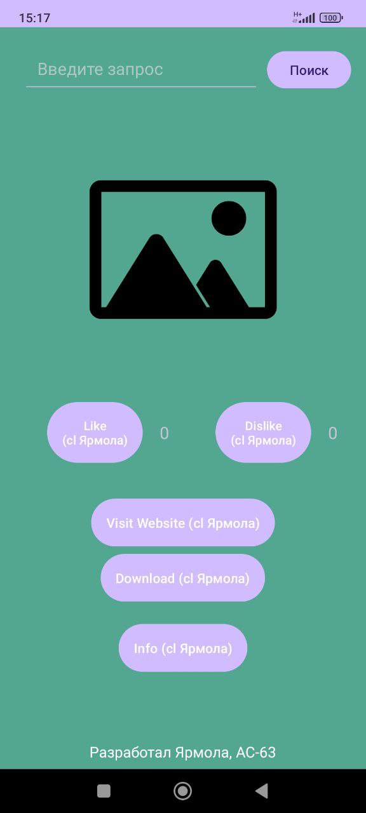
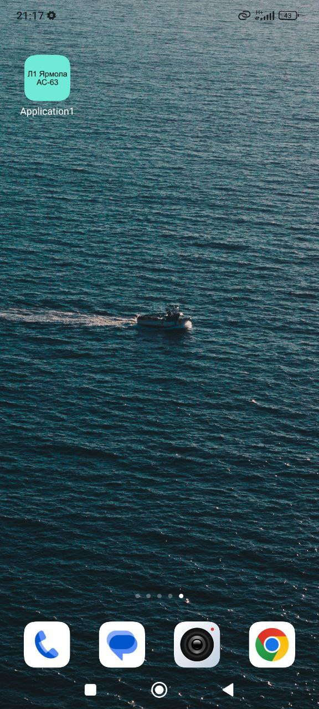
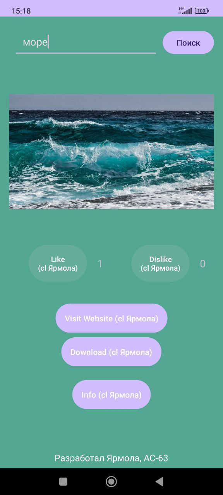

# ImageSearchApp

ImageSearchApp is a simple Android application that allows users to search for images online using a query, view the images, and interact with them by rating (like/dislike), downloading, or visiting the image's website.

## Features
- Search for images online based on a user query.
- Like or dislike images and track the number of likes/dislikes.
- Download images to the device.
- Open the image in a browser to view it on the source website.
- View author information.

## Screenshots





## Requirements
- Android 5.0 (Lollipop) and above.
- Volley for network requests.
- Internet connection to fetch images.

## Installation
1. Clone this repository:
   ```bash
   git clone https://github.com/alexsandro007/ImageSearchApp.git
   ```
2. Open the project in Android Studio.
3. Build and run the project on an Android emulator or physical device.

## API Key Setup
To use the image search functionality, you will need a valid Pixabay API key:
1. Sign up for an API key at [Pixabay API](https://pixabay.com/api/).
2. Replace the placeholder API key in the `MainActivity.java` file:
   ```java
   private static final String API_KEY = "your_api_key_here";
   ```

## Technologies Used
- **Java**: Core programming language for the application.
- **Volley**: For handling network requests and image loading.
- **Pixabay API**: To fetch image search results.
- **Android Studio**: The development environment used for building the app.
